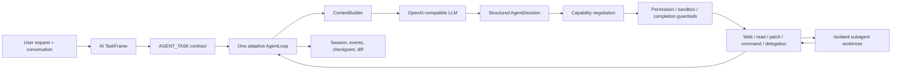

# mini-coding-agent

[](https://github.com/yyzxide/mini-agent/actions/workflows/ci.yml)

A local, auditable AI coding-agent CLI built with TypeScript. The model compiles every request into a structured `TaskFrame`, executes it through one adaptive `AgentLoop`, and keeps repository changes, commands, evidence, context, and child-agent work visible.

The project focuses on the engineering problems behind a coding agent—not on wrapping an LLM in a chat interface:

- one runtime for direct answers, Web research, repository investigation, code changes, and mixed tasks;
- model-driven task understanding with deterministic local safety constraints;
- evidence-backed completion instead of trusting the model's final claim;
- isolated writer/reviewer subagents with parent-controlled merge;
- bounded context, recoverable sessions, and an auditable terminal timeline.

The current product is intentionally CLI-only. It has no bundled backend service, browser UI, or IDE extension.

## Architecture at a glance



Every CLI request and every programmatic `AgentLoop` call enters the same loop as an `AGENT_TASK`. `TaskFrame` records the objective, answer form, required effects, Web evidence policy, explicit constraints, collaboration policy, conversation-evidence request, verification level, and completion criteria. Web access, repository reads, writes, commands, delegation, and individual MCP tools are composable effects requested by model actions; they are not mutually exclusive modes. There is no Direct/Web/Edit runtime switch or natural-language router.

## What makes it different

### TaskFrame-driven execution

Execution starts from a least-privilege bootstrap contract. Safe tools can be discovered, while Web, write, command, and delegation effects are granted or denied as the model proposes concrete actions. Successful completion is checked locally against the TaskFrame, accumulated evidence, permissions, sandbox rules, and post-change verification.

Configured MCP tools are exposed to TaskFrame as a bounded metadata catalog marked as untrusted data. The runtime grants only the exact MCP tool selected by the model, never an entire server or a neighboring repository/command capability. Read-only tools remain usable in Plan mode; mutating external calls still require explicit per-call approval.

### Model-driven task understanding

The model interprets the request and a bounded recent conversation once into a schema-validated `TaskFrame`; local keyword routing does not choose a Direct, Web, or Edit mode first. When older evidence is needed, the frame supplies semantic queries that select a bounded slice from the full session without task-specific question regexes. Invalid TaskFrame output gets one bounded schema-repair attempt. If it is still invalid, `AgentLoop` fails before any decision or tool call instead of executing against guessed intent. Programmatic callers may skip compilation only by supplying an already validated Task Contract. Deterministic code still enforces explicit read-only/no-Web/no-command/no-MCP constraints and never treats a model label as authorization.

For example, these requests intentionally receive different permissions:

```text
只分析这个实现，不要修改文件
不是只分析，把发现的问题直接修复
```

### Isolated multi-agent changes

Repository tasks can delegate investigation, implementation, and review. A writer edits and verifies a disposable Git worktree; a reviewer can inspect the writer's materialized patch; only the parent Agent may merge the result. Parent-worktree changes are fingerprinted and conflicting proposals are rejected instead of overwriting concurrent work.

### Evidence and answer quality

The runtime distinguishes “the model produced an answer” from “the task is complete.” It tracks repository reads, full-file coverage, Web search/fetch evidence, citations, patch scope, verification strength, and whether verification happened after the latest change. Answer depth and shape are evaluated separately so stricter evidence does not collapse responses into minimal summaries.

### Observable without exposing private chain-of-thought

The terminal shows context selection, explicit plans, structured decisions, tools, patches, commands, child-agent progress, guardrail failures, token/cache telemetry, and final changes. It does not print hidden model chain-of-thought. `--verbose`, `--trace`, and `--event-stream` expose progressively more auditable runtime data.

## Requirements

- Node.js 20+
- pnpm 10+ (directly, or through Corepack)
- Git
- ripgrep (`rg`)
- an OpenAI-compatible chat-completions endpoint

Ubuntu:

```bash
sudo apt install ripgrep
```

## Quick start

```bash
git clone https://github.com/yyzxide/mini-agent.git
cd mini-agent
corepack enable
pnpm install
pnpm build
pnpm link --global
```

If `pnpm` is not on `PATH`, use `corepack pnpm` in the commands above. The repository's `packageManager` field pins the expected pnpm version.

Create a local configuration:

```bash
cp mini-agent.config.example.json mini-agent.config.json
```

Set your endpoint, API key, and model in `mini-agent.config.json`, then verify the environment:

```bash
mini-agent doctor
mini-agent
```

`mini-agent.config.json` and `.mini-agent/` are ignored by Git. `mini-agent config show` prints resolved configuration with secrets redacted.

Without a global link:

```bash
pnpm start -- --help
pnpm dev
```

## Configuration

Minimal configuration:

```json
{
  "version": 1,
  "llm": {
    "mode": "real",
    "baseUrl": "https://api.openai.com/v1",
    "apiKey": "your-api-key",
    "model": "your-model",
    "temperature": 0.2,
    "maxTokens": 4096,
    "timeoutMs": 60000
  },
  "multiAgent": {
    "mode": "auto",
    "maxConcurrency": 2,
    "maxBatchesPerRun": 2,
    "maxTasksPerRun": 6
  }
}
```

Environment variables and command-line overrides are also supported. See [`mini-agent.config.example.json`](mini-agent.config.example.json) for LLM, RAG, multi-agent, and MCP options. Embedding environment variables and cache behavior are documented in [`docs/zh-CN/RAG_GUIDE.md`](docs/zh-CN/RAG_GUIDE.md); Memory and Web are runtime capabilities rather than sections in the example JSON.

## Three useful demos

### 1. Permission-aware understanding

```bash
mini-agent run "只分析 src/agent/AgentLoop.ts 的职责，不要修改文件" --verbose
mini-agent run "检查 src/agent/AgentLoop.ts，发现真实问题就修复并验证" --verbose
```

Compare the emitted task contract and model-visible tools.

### 2. Writer and reviewer collaboration

```bash
mini-agent run "使用两个 subagent：一个实现一个小功能，另一个 review；通过后由主 agent 合入并验证" --trace
```

Watch for the disposable worktree, child verification, review dependency, baseline fingerprint, and parent-only merge.

### 3. Conversation and artifact follow-up

```bash
mini-agent
> 创建一个独立的 HTML 贪吃蛇游戏
> 文件在哪里
> 只解释刚才文件的保存位置，不要继续修改
```

The next TaskFrame receives the recent exchange plus a read-only execution ledger. It can therefore resolve the referenced artifact while distinguishing “the assistant mentioned a file” from “the previous run actually changed that file”; there is no hard-coded artifact-follow-up responder.

For a presentation-oriented walkthrough, use [`docs/zh-CN/DEMO_SCRIPT.md`](docs/zh-CN/DEMO_SCRIPT.md).

## CLI map

```text
mini-agent                         Interactive session
mini-agent run <task>              Run one task
mini-agent plan <task>             Create a read-only plan
mini-agent review <file>           Review one file
mini-agent resume <sessionId>      Resume a session

mini-agent diff                    Inspect task/repository changes
mini-agent status                  Summarize repository state
mini-agent doctor                  Diagnose environment and configuration
mini-agent logs                    Inspect runtime logs
mini-agent changes                 Inspect task change records

mini-agent memory ...              Manage long-term memory
mini-agent rag ...                 Manage repository knowledge
mini-agent skill ...               Manage declarative skills
mini-agent mcp ...                 Inspect configured MCP servers
mini-agent bench ...               Run AgentBench evaluations

mini-agent tool ...                Inspect or invoke tools
mini-agent command ...             Debug controlled command execution
mini-agent patch ...               Preview or apply a unified diff
mini-agent git ...                 Debug Git integration
```

Useful runtime options:

```bash
mini-agent run "fix the failing test" --max-steps 20
mini-agent run "inspect the context selection" --verbose
mini-agent run "audit the complete runtime decision record" --trace
mini-agent run "stream structured events" --event-stream
mini-agent run "use two subagents to implement and review" --agents 2
```

Multi-agent support is available in `auto` mode by default. Natural-language intent controls whether delegation is required, useful, or disabled. `--agents` overrides concurrency; it is not the primary activation mechanism.

## Runtime and safety model

- File tools resolve paths inside the repository and reject internal metadata such as `.git` and `.mini-agent`.
- Large files use token-bounded pagination; complete-file tasks track line coverage through EOF.
- Unified diffs pass `git apply --check` before application.
- Commands are structured with shell disabled by default; risky execution requires approval.
- Source and configuration changes require relevant verification after the latest patch.
- Web citations can only use URLs gathered during the current task.
- Failed research can end with an explicit evidence limitation instead of looping or inventing a URL.
- Checkpoints persist bounded execution state and recover interrupted work without replaying raw side effects.
- Child writers cannot directly modify the parent worktree.

These are application-level controls, not an operating-system security sandbox. See [`docs/zh-CN/PROJECT_STATUS.md`](docs/zh-CN/PROJECT_STATUS.md) for the explicit product boundary.

## Context, memory, and retrieval

The project keeps four concepts separate:

- conversation history: visible user/assistant exchanges;
- session context: task-selected records under a token budget;
- long-term memory: governed preferences, conventions, decisions, and verified outcomes;
- provider prompt cache: provider-reported token reuse, observed but not controlled by the Agent.

Context compaction uses structured salience rather than retaining only the latest tail. Selected, truncated, and excluded sections are observable in trace output. Repository RAG is a separate, citation-bearing Markdown/TXT knowledge index with hybrid retrieval and offline evaluation.

## Development and verification

```bash
pnpm verify
pnpm build
pnpm typecheck
pnpm lint:unused
pnpm test
pnpm bench -- --baseline benchmarks/baselines/core-v1.json
```

`pnpm verify` is the canonical gate: it checks that every TypeScript source file is reachable from the CLI entry point, rejects unreferenced exports, validates documentation references, performs a clean build, rejects unused local declarations, and runs the deterministic suite. The tests cover semantic contracts and permissions, conversation provenance, Web evidence, full-file reads, patch and command safety, child worktree isolation, parent/child conflicts, terminal rendering, storage recovery, Memory, RAG, MCP, and evaluation.

CI runs on pushes and pull requests to `main`. Real-model and live-Web behavior remain opt-in because CI must be deterministic and must not require external credentials.

## Documentation

| Document | Purpose |
| --- | --- |
| [Chinese documentation index](docs/zh-CN/README.md) | Canonical navigation and reading order |
| [Architecture](docs/zh-CN/ARCHITECTURE.md) | Current runtime and control-plane design |
| [Architecture evolution](docs/zh-CN/ARCHITECTURE_EVOLUTION.md) | Concise A → B decisions and retained history |
| [Project status](docs/zh-CN/PROJECT_STATUS.md) | Verified capabilities, limitations, and maturity |
| [Demo script](docs/zh-CN/DEMO_SCRIPT.md) | Three interview-ready scenarios |
| [Test plan](docs/zh-CN/TEST_PLAN.md) | Automated and manual verification strategy |
| [Roadmap](docs/zh-CN/ROADMAP.md) | Deliberately bounded next steps |
| [Interview package](docs/zh-CN/RESUME_PACKAGE.md) | Accurate resume positioning and talking points |

## Scope

This repository is an engineering-oriented local Agent prototype. It is suitable for studying and demonstrating:

- Agent runtime design;
- task contracts and least privilege;
- context engineering and evidence control;
- local coding-tool integration;
- observable multi-agent collaboration;
- repeatable Agent evaluation.

It does not claim parity with Claude Code or Codex, production-grade sandboxing, stable real-time search across all domains, autonomous completion of arbitrary tasks, or complete MCP protocol coverage.
