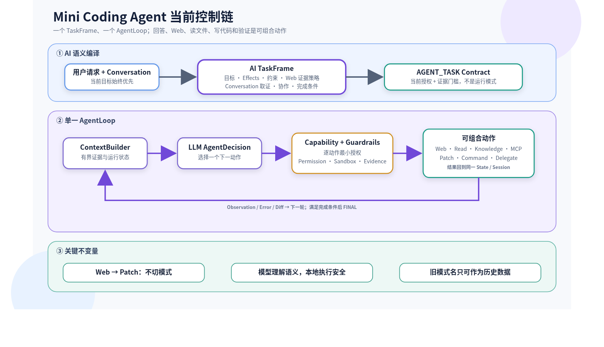

# 当前架构：TaskFrame + 单一 AgentLoop

本文只描述当前源码。历史方案和迁移原因见 [架构演进记录](ARCHITECTURE_EVOLUTION.md)。

## 1. 核心结论

`mini-coding-agent` 只有一条任务执行链：

```text
User request + Conversation
  -> TaskFrameResolver（模型语义编译）
  -> TaskFrame Schema validation
  -> AgentTaskContract（当前授权与证据要求）
  -> AgentLoop
       -> ContextBuilder
       -> LlmClient
       -> AgentDecision
       -> CapabilityNegotiator
       -> Permission / Sandbox / Guardrails
       -> Tool / Patch / Command / Delegation
       -> 下一轮 AgentDecision
  -> Completion validation
  -> Session / Event / Checkpoint / Diff
```

不存在 Direct、Web、Review、Edit 等互斥运行模式，也不存在根据用户问句先选择执行器的 `TaskRouter`。普通回答是在 AgentLoop 第一次决策返回 `FINAL`；文件分析会选择 `read_file`；Web 研究会选择 `web_search` / `fetch_url`；写代码会选择 `APPLY_PATCH`。这些动作可以在同一次运行中连续出现。

Capability Registry 是产品能力的唯一事实源，并明确区分三类机制：`tools` 是可用于 `TOOL_CALL` 的真实注册工具，`actions` 是顶层 `AgentDecision`（如 `APPLY_PATCH`、`RUN_COMMAND`、`DELEGATE`），`surfaces` 是 CLI、Slash Command 或声明文件入口。Registry 当前同时登记核心执行能力以及 MCP、Session、Long-term Memory、Skills、AgentBench，不再由不同模块各写一份能力说明。

产品能力问题也走 AI 语义链：TaskFrame 的 `productCapability.act/capabilityIds` 表达用户是在询问能力清单、可用性还是边界，`CapabilityTruthGuard` 再从 Registry 生成最终事实回答。Guard 不扫描原始问句或最终文本，也没有“联网/写文件/子代理”三套专项正则；新增表达方式不需要修改本地问句规则。

因此：

- Web 搜索完成后可以直接继续读仓库、修改文件和验证，不需要切换“编辑模式”。
- 用户提供仓库内绝对路径时，`read_file` 可以读取并统一返回仓库相对路径。
- `read_file.maxLines` / `maxTokens` 过大时自动截断到安全上限，不再把无害的分页建议当成 Schema 错误。
- 旧配置中的 `controlPlane` 字段只会在加载时被丢弃，不能重新启用第二套运行时。

## 2. TaskFrame：唯一语义记录



TaskFrame 由模型结合当前请求与最近 Conversation 生成，并由 Zod 校验。主要字段如下：

| 字段 | 含义 |
|---|---|
| `objective` | 当前任务目标 |
| `target` | `REPOSITORY`、`WORLD`、`PRODUCT`、`SESSION`、`DERIVATION` 或 `MIXED` |
| `productCapability` | 产品能力元问题的结构化意图，以及从 Registry 选择的能力 ID；普通任务为 `NONE` |
| `answer` | 答案形态与深度 |
| `effects` | 回答、仓库读写、Web、知识库、命令、验证、委派、MCP |
| `webEvidencePolicy` | 模型选择的 `ORDINARY / CORROBORATED / CURRENT / HIGH_STAKES` 证据等级、语义依据，以及 `REPRESENTATIVE / SUPERLATIVE` 查询范围 |
| `constraints` | 只读、禁网、禁命令、禁委派、禁 MCP、完整文件读取 |
| `collaboration` | 是否要求 writer、reviewer 与代理数量 |
| `conversationEvidence` | 当前目的（普通上下文、指代或旧回答核查）、是否需要更早历史、语义查询和最近消息窗口 |
| `completionCriteria` | 可观察的完成条件 |

TaskFrame 负责语义，不负责授权。即使模型声明需要写入或命令，运行时仍要经过 Capability、Permission、Sandbox 和 Guardrail。

验证效果同时记录 `verification` 和 `verificationBasis`。只有用户明确要求某个验证强度时才使用 `USER_REQUIRED`，并原样保留该等级；普通修改任务使用 `TASK_INFERRED`，Completion Contract 会在 Patch 确定真实目标文件后选择兼容等级。这样既不会把用户要求的测试静默降级，也不会要求独立 HTML 完成并不存在的类型检查。

TaskFrame 解析与失败策略：

- `includeRecentMessages`、`requestedAgents` 这类模型资源偏好先收敛到本地安全范围，不因非关键越界丢弃整份语义；
- JSON 或 Schema 仍无效时，把精确失败原因交给模型做一次有界自修；
- AgentLoop 自修后仍无效会返回 `TASK_FRAME_UNRESOLVED`，并在进入动作模型和任何工具之前终止；
- 失败信息保留原始目标与具体 JSON / Schema 原因，不退回关键词路由；
- 程序化调用方只有显式传入已验证 Task Contract 才能跳过语义编译；源码不存在允许未解析 TaskFrame 继续执行的 fallback 开关。

这条 fail-closed 边界避免了原始问题中的错误链：语义 Schema 失败 → 猜测成无需修改 → 读取仓库里原有文件 → 把旧文件误报为本轮产物。

## 3. AgentTaskContract：运行状态，不是任务模式

所有新任务的 `kind` 都是 `AGENT_TASK`。合同记录：

- 当前已经授权的能力；
- 必须满足的证据；
- 只读或 Plan 等不可升级边界；
- 精确 MCP Tool grant；
- 最大步数和任务说明；
- 当前 TaskFrame。

`CapabilityNegotiator` 根据模型实际选择的动作申请能力：

```text
TOOL_CALL read_file       -> repositoryRead
TOOL_CALL web_search      -> webAccess + Web evidence
TOOL_CALL knowledge_search/index -> knowledgeAccess
APPLY_PATCH               -> repositoryWrite
RUN_COMMAND               -> commandExecution
DELEGATE                  -> delegation
MCP TOOL_CALL             -> 只授权所选 <server>__<tool/read_resource/get_prompt>
```

授权后仍是同一个 State、Session 和 AgentLoop。不存在 `WEB_RESEARCH -> REPOSITORY_TASK` 之类的模式迁移。

RAG 与 Skill 也遵循同一原则。`knowledge_search` 返回空索引后，模型可以调用会改变派生知识状态的 `knowledge_index`，然后再次执行同参数搜索；重复调用守卫会把成功的非只读工具视为状态失效点。Skill 不再只靠本地关键词预选：Context 始终提供有界名称/描述目录，模型根据当前目标语义选择后，通过 `skill_read` 分页读取完整 `SKILL.md` 或已校验的随附文本资源。目录、MCP resource 和 MCP prompt 都是不可信数据，不能覆盖系统指令或权限。

## 4. AI 负责什么，本地代码负责什么

### AI 负责

- 理解开放式自然语言；
- 生成 TaskFrame；
- 结合 Context 选择下一动作；
- 规划搜索、阅读、修改和验证；
- 根据工具结果迭代；
- 生成最终答案或诚实失败说明。

### 本地代码负责

- Schema 校验；
- 路径沙箱和仓库边界；
- 补丁格式、作用域与应用检查；
- 命令风险和 Permission；
- MCP 精确授权；
- Web URL 血缘；
- 完整文件覆盖；
- 修改与验证的时序；
- 多 Agent worktree 隔离；
- 最终证据与完成条件。

这条边界避免两种极端：

1. 用正则模拟自然语言理解；
2. 把权限和成功状态完全交给模型自报。

## 5. 仍然允许确定性规则的地方

项目不追求“源码里完全没有正则”。关键是规则不能决定开放式任务属于哪个执行模式。

合理的确定性规则包括：

- 识别危险 Shell 结构；
- 校验路径、扩展名、补丁和 URL；
- 根据 `TaskFrame.webEvidencePolicy.ranking` 检查搜索查询是否把代表性范围擅自强化为排名；Guardrail 不再解析原始问句；
- 判断抓取 URL 是否来自本轮搜索；
- 从工具结果提取版本、日期、文件和行号；
- 对 TaskFrame 选定的 Memory 查询做通用规范化、关键词和实体提取；
- 读取旧 Session 的历史结果标签。

不允许重新出现的规则包括：

- “出现某个中文短语就进入 Direct 模式”；
- “出现 search 就只能联网，之后不能写文件”；
- “出现文件审查就开放/关闭一组固定工具”；
- “短追问命中特殊句式就绕过模型直接回复”；
- “用原始问句正则决定最新版任务的证据门槛”。

模型只在 `TaskFrame.webEvidencePolicy` 中判断语义证据等级和查询是否允许排名，不直接决定任意数字门槛。本地策略表把等级映射为搜索视角、抓取、独立域名、时效和权威来源要求；Guardrail 只执行映射后的结构化策略。

## 6. Context 与 Conversation

TaskFrame 先使用固定预算的最近 Conversation。需要更早证据时，模型通过 `conversationEvidence` 提供语义查询；`TaskFrameConversationSelector` 从完整 Session 选择匹配消息及相邻上下文。

Conversation 中的助手文字只证明“上一轮说过什么”，不证明上一轮真实产生过仓库效果。`ConversationHistory` 会从该轮 `AGENT_CHECKPOINT` 和 `FILE_CHANGE` 构建只读执行账本，向后续 TaskFrame 和动作模型提供 `repositoryChanged`、`changedFiles` 与补丁后验证状态。若旧助手文字声称“已创建”，而账本显示没有成功 Patch，控制面以账本为准。

ContextBuilder 不因问句关键词自动预加载仓库树、README、Git diff 或构建文件。模型需要仓库证据时调用安全读取工具。

系统区分：

- Conversation：用户与助手可见消息；
- AgentState：当前运行的 Decision、Tool、Patch、Command 和错误；
- Context：本轮选择给模型的有界证据；
- Session Memory：当前 Session 的结构记录；
- Long-term Memory：策略允许写入的稳定偏好、决策和已验证结果；
- Prompt Cache / Embedding Cache：服务商或本地的计算复用。

## 7. Web 研究与继续写代码

Web 是可组合能力，不是执行器。

```text
TaskFrame(target=MIXED, webEvidence=true, repositoryWrite=REQUIRED)
  -> web_search
  -> fetch_url
  -> read_file（可选）
  -> APPLY_PATCH
  -> RUN_COMMAND（需要时）
  -> FINAL
```

模型选择 `webEvidencePolicy.profile`，本地策略映射为：

- `ORDINARY`：普通定义、解释和一般联网查询；一次搜索、一个已抓取引用来源；
- `CORROBORATED`：用户明确要求多源核验；两个抓取来源和两个独立域名；
- `CURRENT`：明确最新、当前或内在易变事实；两个非等价搜索视角，并抓取一个精确的权威时效来源；
- `HIGH_STAKES`：医疗、法律、金融和安全等错误信息可能造成实质伤害的领域；使用严格权威与时效要求。

`WebResearchProgress` 把当前证据阶段返回 Context，Agent 可以看到下一步应搜索、抓取、比较还是综合。接近步数上限时预留最终综合步骤；若模型仍提交不满足门槛的成功结论，运行时确定性返回“部分结论、具体证据缺口、已检查来源”，不再继续循环。普通任务有可引用资料时可以透明降级；严格任务保持 `success=false`，但仍向用户交付限制性总结。

`CURRENT`、`CORROBORATED` 和 `HIGH_STAKES` 的成功终局还必须提交结构化 `webClaims`：每条重要事实结论关联一个或多个本轮成功抓取的精确 URL，并且结论与 URL 都要出现在用户可见摘要中。本地门禁验证结构、抓取血缘和可见性，不使用问句关键词推断，也不把字符串关联夸大为语义蕴含证明。

`webSearch.providerOrder` 决定 Provider 链。默认链是免凭据的 DuckDuckGo HTML/Lite；配置 Brave Search API 后可以把 `brave` 放在首位，并在失败时继续尝试后续 Provider。配置加载、默认 Registry、CLI 初始化和 `doctor` 共用同一份解析结果，避免“配置写了但运行时没接上”。

`fetch_url` 根据 HTTP `charset` 或 HTML `<meta charset>` 选择解码器，兼容 GB2312 / GBK / GB18030 等旧中文网页，同时继续保持大小、超时、重定向与 SSRF 边界。HTTP 200 并不自动算成功证据：WAF/CAPTCHA、登录壳、空正文以及带强错误标题或短错误正文的软 404 会返回结构化 `FETCH_URL_CONTENT_UNUSABLE`。

## 8. 仓库工具与 `read_file`

安全读取工具在 TaskFrame 完成后可发现，并在模型选择后获得最小授权：

- `list_files`
- `read_file`
- `search_code`
- `git_status`
- `git_diff`
- `verify_file`

`read_file`：

- 接受仓库相对路径和位于仓库内的绝对路径；
- 拒绝仓库外路径、内部 `.git/.mini-agent`、目录和二进制文件；
- 自动限制最大行数与 Token；
- 返回 `hasMore`、`nextStartLine`、`nextStartColumn`；
- 为完整审查记录来源哈希和分页覆盖。

“输入无效”只应用于真正不符合 Schema 的字段；过大的安全分页建议会被调整并在 metadata 中说明。

`verify_file` 是不执行仓库代码的只读、文件类型感知验证器。目前支持 HTML（基础结构和内嵌 classic JavaScript 语法）、JSON、`.js` 与 `.cjs`。命令验证仍会做“验证器—目标类型”兼容检查，例如 `node --check page.html` 会在启动进程前以 `VERIFIER_TARGET_MISMATCH` 拒绝，并引导 Agent 对独立 HTML 使用 `verify_file`；该失败不能被计入完成证据。

### 8.1 文件系统状态与 Git 状态分离

文件是否存在由工作区文件系统决定，与 Git 是否跟踪无关。成功的 `read_file` 证据明确表示 `Filesystem state: EXISTS`；即使 `git status` 显示 `?? path`，模型也必须把它作为现有文件修改。Git 状态只用于审计用户已有变更、生成差异、提交和推送，不能把未跟踪文件解释成待创建文件。

`PatchManager` 在调用 `git apply --check` 前把 unified diff 解析为 `ADDED / MODIFIED / DELETED / RENAMED` 文件操作，并对目标执行文件系统预检：创建已存在路径返回 `PATCH_TARGET_ALREADY_EXISTS`，修改或删除缺失路径返回 `PATCH_TARGET_MISSING`。普通上下文不匹配才进入 `PATCH_CONTEXT_MISMATCH`。这些结构化代码、目标路径、操作类型和受限 stderr 会完整进入 AgentState、Diagnostics 与下一轮模型 Context。

Patch 还必须包含真实内容变化。只有文件头和上下文、没有任何 `+`/`-` 变更行的占位或整文件原样复制 Patch，会在进入 `git apply` 前返回 `PATCH_NO_CHANGES`；这样模型得到的是“没有提交修改”的根因，而不是误导性的 corrupt-patch/context-mismatch。

连续失败保护使用“去除描述文本后的 Decision + 精确错误”指纹。相同失败动作重复两次便保留根因终止，不再被不同 description 绕过，也不会最终退化为无法定位的 `Agent failed too many consecutive steps`。

循环保护还统计“自上次新增完成证据以来”的 Guardrail 复现次数，因此 `FINAL_WITH_INSUFFICIENT_VERIFICATION -> VERIFIER_TARGET_MISMATCH -> FINAL...` 这类交替循环不会绕过连续失败判断并耗尽全部步数；成功 Patch、有效验证、读取证据或委派结果会重置该计数。

## 9. 完成性与验证

模型返回 `FINAL success=true` 不代表运行立即成功。Guardrail 会检查：

- Required 写入是否真实发生；
- 读取或发现的旧文件不能冒充本轮创建/修改产物；
- 条件写入是否有调查依据；
- 目标文件是否读取；
- 完整审查是否覆盖到 EOF；
- Web 搜索、抓取、时效、权威和引用是否满足 TaskFrame；
- 知识库回答是否执行 `knowledge_search`；
- 源码/配置修改是否在最新补丁之后通过相关验证；
- 验证动作是否与目标文件类型兼容；独立 HTML 可由 `verify_file` 提供 scoped `SYNTAX` 证据；
- 明确要求的 writer/reviewer 是否完成；
- 答案形态和深度是否满足 TaskFrame。

当 Web 或知识证据确实不足时，动作模型必须用结构化 `evidenceStatus: "INSUFFICIENT"` 声明限制。Guardrail 不再扫描中英文“无法核验”等措辞猜测它是否在诚实降级。

## 10. 多 Agent

多 Agent 仍在父 AgentLoop 中编排：

- `READ_ONLY` 子任务调查仓库；
- `PROPOSE_CHANGES` writer 在临时 worktree 修改和验证；
- `REVIEW_CHANGES` reviewer 读取物化后的依赖补丁；
- 只有父 Agent 能执行 `APPLY_DELEGATED_PATCH`；
- 父工作区改变时重新校验基线与补丁；
- 冲突返回 `DELEGATED_PATCH_CONFLICT`；
- 用户明确要求子 Agent 时，预算耗尽返回 `REQUIRED_DELEGATION_EXHAUSTED`，主 Agent 不能偷偷代写。

## 11. 历史数据兼容

源码仍能读取旧 Session / Change Log 中的 `DIRECT_ANSWER`、`WEB_ANSWER`、`CODE_REVIEW` 等结果字符串，也能迁移旧配置文件位置。这些是持久化数据兼容，不是当前执行模式。若模型服务仍输出旧的只读委派 Decision，解析边界会把它归一化为当前 `DELEGATE` 的 `READ_ONLY` 子任务；运行时本身没有第二个旧委派分支。

当前配置没有 `controlPlane` 选项。旧配置里即使存在 `"controlPlane": "legacy"`，加载后也会删除该字段。

### 11.1 结构化决策的输出预算与推理降级

`OpenAICompatibleClient` 默认给控制面决策 `16384` 个输出 Token。服务商以 `finish_reason=length` 返回时，运行时把它识别为 `LLM_OUTPUT_BUDGET_EXHAUSTED`，而不是伪装成普通 JSON 语法错误；随后只执行一次紧凑恢复，预算最多扩展到 `32768`。对支持显式思考开关的 DeepSeek 接口，该次恢复会关闭思考，避免再次把全部预算消耗在隐藏推理中。若恢复仍耗尽，错误直接向上返回，不再进入 AgentLoop 的通用协议重试。

`reasoning_content` 只用于“是否存在”和 reasoning token 遥测，永远不作为 TaskFrame 或 AgentDecision 的解析输入。正常空响应和普通 Schema/JSON 错误仍各有一次客户端级纠正；AgentLoop 的额外协议恢复上限也收敛为一次，防止调用呈乘法放大。`llm.thinkingMode` 可设为 `auto`、`enabled` 或 `disabled`；默认 `auto` 不向未知 OpenAI-compatible 服务商发送扩展字段。

## 12. 对应源码

- `src/runtime/TaskFrame.ts`
- `src/runtime/TaskFrameResolver.ts`
- `src/runtime/TaskFrameContract.ts`
- `src/runtime/TaskFrameConversationSelector.ts`
- `src/agent/AgentLoop.ts`
- `src/agent/CapabilityNegotiator.ts`
- `src/agent/TaskCollaborationPolicy.ts`
- `src/agent/TaskGuardrails.ts`
- `src/agent/WebResearchProgress.ts`
- `src/context/ContextBuilder.ts`
- `src/session/ConversationHistory.ts`
- `src/llm/LlmClient.ts`
- `src/llm/OpenAICompatibleClient.ts`
- `src/tools/ReadFileTool.ts`
- `src/tools/ToolErrorFormatter.ts`
- `src/patch/PatchManager.ts`
- `src/cli/AgentLoopTask.ts`
- `scripts/check-architecture.mjs`
- `scripts/check-exports.mjs`
- `scripts/check-docs.mjs`

当前只有这一套运行时目录与任务契约编译器，不存在版本化的并行控制面。
